<h1>Hi, I'm Mohamed Raslan</h1>

  
  
  

  Software Test Automation Engineer focused on reliable software, practical DevOps, test automation, and tools that make quality easier to measure, improve, and trust.

### What I Do

- Build test automation and quality workflows across web, desktop, APIs, and CI/CD.
- Explore testing tools, AI-assisted ideas, DevOps practices, and automation patterns.
- Build practical QA tools, examples, and playgrounds that make testing easier to learn and use.

### Professional Highlights

- Software testing across manual, API, automation, web, and desktop contexts.
- ISTQB certified: CTFL, CTFL-AT, and CTFL-MAT.
- Open-source maintainer of [pytest-qatouch](https://github.com/MohamedRaslan/pytest-qatouch).
- Builder of [UTasks](https://github.com/TestMECA/UTasks), a practical app for learning UI testing and debugging.

 

---

  
  
  
  
  
  
  
  
  
  
  
  
  
  
  
  
  
  
  
  
  
  
  
  
  
  
  
  

---

<table>
  <tr>
    <td width="50%">
      
    </td>
    <td width="50%">
      
    </td>
  </tr>
</table>

### Featured Work

  

  

  

